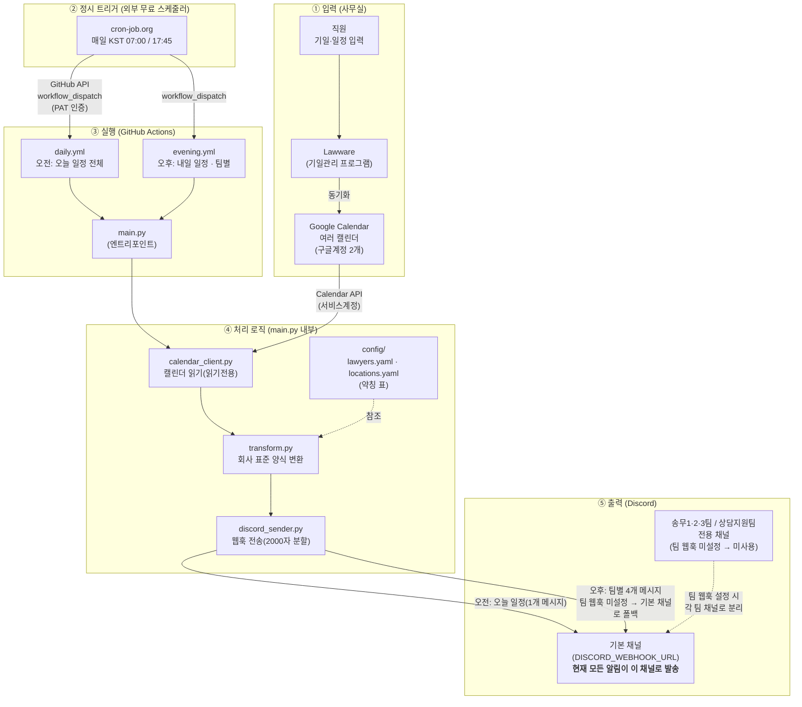

# 전체 구성도 — Lawware → Discord 자동 알림

법무법인 노바 기일 일정 알림 봇의 **데이터 흐름 전체**입니다.
(GitHub에서 이 파일을 열면 아래 다이어그램이 그림으로 렌더됩니다.)

## 한눈에 보는 흐름

> **현재 동작**: 오후 알림은 송무1·2·3팀·상담지원팀별로 **메시지는 따로 4개** 만들지만,
> 팀 전용 웹훅(`DISCORD_WEBHOOK_URL_SONGMU1` 등)이 설정돼 있지 않아 코드의 폴백 규칙
> (`env_key or DISCORD_WEBHOOK_URL`)에 따라 **모두 기본 채널로 발송**됩니다.
> 각 팀 채널로 분리하려면 팀별 웹훅 Secret을 설정하면 됩니다.

---

## 단계별 설명

| 단계 | 무엇이 | 어떻게 |
|---|---|---|
| **① 입력** | 직원이 Lawware에 기일 입력 | Lawware → Google Calendar로 **동기화** (구글계정 2개의 여러 캘린더) |
| **② 트리거** | cron-job.org가 정시에 깨움 | 매일 **KST 07:00 / 17:45**, GitHub 토큰(PAT)으로 `workflow_dispatch` 호출 |
| **③ 실행** | GitHub Actions가 봇 구동 | `daily.yml`(오전) / `evening.yml`(오후) → `python main.py` |
| **④ 처리** | 캘린더 읽기 → 변환 → 전송 | `calendar_client`(읽기) → `transform`(양식·약칭, `config/` 참조) → `discord_sender` |
| **⑤ 출력** | Discord 채널로 발송 | 오전=기본 채널 1곳 / 오후=팀별 4개 메시지로 분류하되, **팀 웹훅 미설정이라 현재는 모두 기본 채널로 발송** |

---

## 두 알림의 차이

| | 오전 알림 | 오후 알림 |
|---|---|---|
| 트리거 시각(KST) | **07:00** | **17:45** |
| 워크플로 | `daily.yml` | `evening.yml` |
| 실행 명령 | `python main.py` | `python main.py --next-day --teams` |
| 대상 날짜 | **오늘** | **내일** |
| 발송 형태 | 전체를 **하나의 메시지** → 기본 채널 | **팀별 4개 메시지로 분류** → (팀 웹훅 미설정) **현재 모두 기본 채널** |

---

## 왜 cron-job.org를 거치나? (핵심)

GitHub Actions의 `schedule:` cron은 **정시 실행을 보장하지 않습니다**(best-effort).
혼잡 시 수십 분~수 시간 지연됩니다 (실제 07:00→08:11, 17:45→20:17 발생).

→ 그래서 **외부 무료 스케줄러(cron-job.org)가 정시에 GitHub를 깨우고**,
GitHub의 `schedule:` cron은 중복 발송 방지를 위해 비활성화(주석)했습니다.
외부 스케줄러는 GitHub 작업 큐와 무관하게 정시 동작하므로 지연이 거의 사라집니다.

> 관련 문서: [`외부-스케줄러-설정.md`](./외부-스케줄러-설정.md)

---

## 인증·보안 요약

| 구간 | 인증 수단 | 비고 |
|---|---|---|
| Google Calendar 읽기 | **서비스계정 키(JSON)** · 읽기전용 | GitHub Secrets에 보관, 각 캘린더에 공유 필요 |
| cron-job.org → GitHub | **Fine-grained PAT** (Actions: write) | 저장소 1개로 권한 최소화 |
| 봇 → Discord | **웹훅 URL** | 채널별 웹훅, 비공개 채널 권장 |

> 모든 비밀값(서비스계정 키·웹훅·토큰)은 코드에 넣지 않고 **GitHub Secrets / 외부 서비스 설정**으로만 보관합니다.
